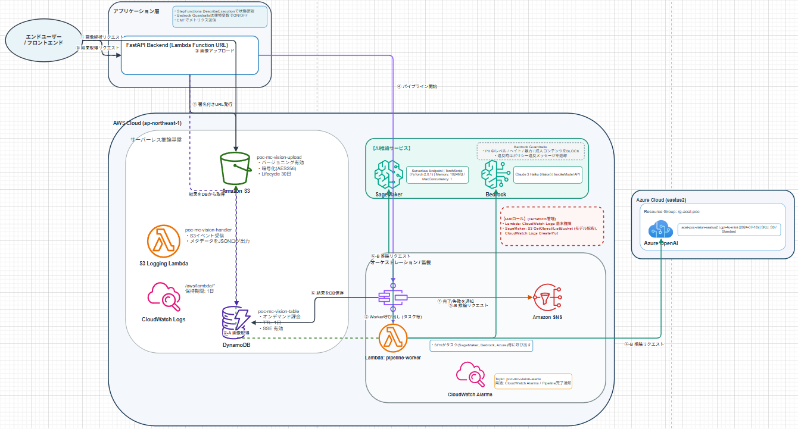

# PoC MC Vision ― AWS中心のAI推論基盤PoC（Azure連携の検証付き）

## 🚀 エグゼクティブサマリー ＆ 主要技術成果

本PoCは、画像を各種 AI サービス（AWS SageMaker・Bedrock・Azure OpenAI）で推論し、その結果を集約・保存するシステムを題材に、AWS を中心とした AI 推論基盤の構築・運用に必要な要素を実装・検証したものです。

Terraform と GitHub Actions による再現可能なインフラ管理、Step Functions による推論ワークフロー自動化、CloudWatch Alarms による監視、Bedrock Guardrails による出力制御・セキュリティ対策まで一通り実装し、本番運用を想定した構成としています。
また、CloudWatch ダッシュボードで主要コンポーネントのメトリクスを可視化し、運用監視を一元化しています。

| 観点 | 実装内容 |
| :--- | :--- |
| **IaCによる再現性** | AWS／Azureの主要リソースをTerraformでコード化し、約10分で再構築が可能。 |
| **ワークフロー自動化** | Step Functions で SageMaker→並列(Bedrock+Azure)→DynamoDB→SNS の推論パイプラインを実装。 |
| **マルチクラウド連携** | 単一のAPIエンドポイントからAzure OpenAIも呼び出せるようにし、マルチクラウド構成もあわせて実装。  |
| **CI/CDパイプライン** | GitHub Actions で Terraform の自動検証・手動承認付きデプロイと、バックエンドコンテナの自動デプロイを実装。Concurrency制御でインフラ→アプリの順序を保証。 |
| **監視・アラート** | CloudWatch Alarms と SNS Email 通知で異常を検知し、CloudWatch ダッシュボードで運用監視を一元化。 |
| **AIの安全性確保** | Bedrock GuardrailsでPII（個人識別情報）検知・有害コンテンツフィルタリングを実装。 |
| **セキュリティ基盤** | S3暗号化・バージョニング・構造化ログ・tfsecスキャンなど、基本的なセキュリティ設定を実装。 |

---

## 🎯 PoCの背景と目的

「AWS上のAI推論基盤／MLOps案件」参画を意識して、モデル開発ではなく、インフラ構成・ワークフロー・監視・セキュリティといった基盤周りを一通り実装・検証した PoC です。

---

## 🛠 システム概要

本PoCで構築したシステムは、Reactフロントエンドからアップロードした画像を、主に AWS（SageMaker Serverless / Bedrock）で推論し、必要に応じて Azure OpenAI も利用する AI 推論基盤です。

推論の実行には、目的別に次の2つの経路があります。

1.  **APIトリガーによる非同期実行（メインフロー）**
    *   ユーザーがAPIを呼び出すと、**Step Functionsが起動**します。
    *   Step Functionsが推論パイプライン（SageMaker → 並列(Bedrock + Azure) → DynamoDB保存 → SNS通知）を自動で実行します。
2.  **FastAPIによる同期実行（個別推論用）**
    *   各AIサービスを個別に推論するため、FastAPI経由で直接推論APIを実行して結果を表示します。

AWS・Azureの認証情報は環境変数で管理します。Bedrock GuardrailsでPII（個人識別情報）検知と有害コンテンツフィルタリングを実行し、CloudWatch Alarmsで主要サービスの障害や遅延を検知してSNS Email通知を送信します。

### **アーキテクチャ図**



*Draw.ioファイル: [poc-mc-vision-architecture.drawio](./docs/poc-mc-vision-architecture.drawio)*

### **処理フロー**

```
【ユーザー操作】
React フロントエンド
│
├── ① FastAPI直接実行（同期処理）
│   ├── 解析API実行
│   │   └── FastAPI (Lambda)
│   ├── 推論実行
│   │   ├── SageMaker
│   │   ├── Bedrock
│   │   └── Azure OpenAI
│   └── DynamoDB保存
│
└── ② Step Functions自動実行（非同期処理）
    ├── API呼び出し（S3キー指定）
    │   └── Step Functions起動
    │       ├── SageMaker推論（順次）
    │       ├── Bedrock + Azure（並列）
    │       │   └── Guardrails適用
    │       ├── DynamoDB保存
    │       ├── SNS Email通知
    │       └── CloudWatch Logs記録

【監視・アラート】
CloudWatch Alarms + SNS Email通知
├── Lambda監視
│   ├── FastAPI Lambda
│   │   └── エラー/スロットリング検知,レイテンシ監視
│   ├── Pipeline Worker Lambda
│   │   └── レイテンシ監視,エラー検知
│   └── S3 Ingest Lambda
│       └── レイテンシ監視,エラー検知
├── Step Functions監視
│   └── 実行失敗/スロットリング/タイムアウト検知
└── SageMaker監視
    └── エンドポイント呼び出しエラー検知
```

---

### 📸 動作証跡

実装時の動作確認やデプロイ結果のスクリーンショット等の証跡は、[docs/証跡](./docs/証跡) ディレクトリに格納しています。

---

## ✨ 技術スタックと主要機能

### **インフラ（IaC）**
- **Terraform** (1.9.8): 主にAWS（一部Azure）のインフラをコードで定義・管理。
- **State管理**: S3バックエンドに状態を保存し、DynamoDBでロックを管理。

### **AWS サービス**
- **Step Functions**: メインの推論パイプラインをオーケストレーション。
- **Lambda**:
    - **FastAPIコンテナ**: APIエンドポイントを提供 (ECR経由)。
    - **Pipeline Worker**: Step Functionsから呼び出され、各AIサービスへのリクエストを実行。
    - **S3 Event Logger**: S3へのアップロードイベントをログに記録する補助機能。
- **AI / ML**:
    - **SageMaker Serverless**: カスタムPyTorchモデル（ResNet18）のホスティング。
        - 画像分類タスクとして十分な精度がありつつ比較的軽量なモデルのため、Serverless Inference のメモリや起動時間と相性が良いと判断して採用。
        - 本PoCでは、S3へのアップロードをきっかけに不定期に推論を行う構成のため、常時起動のエンドポイントではなく Serverless を選択し、待機コストを抑えるようにしています。
    - **Bedrock**: Claude 3 Haikuモデルを利用（Guardrails適用）。
- **データストア**:
    - **S3**: 画像アップロード先（暗号化, バージョニング, ライフサイクル設定）。
    - **DynamoDB**: 推論結果の保存（オンデマンド, TTL設定）。
- **監視 & 通知**:
    - **CloudWatch Alarms**: 11個のアラームで主要コンポーネントを監視（Lambda、Step Functions、SageMaker）。
    - **CloudWatch Dashboard**: 9個のウィジェットで主要コンポーネントを可視化（Step Functions、SageMaker、Lambda、DynamoDB）。
    - **SNS**: アラーム発報時やパイプライン完了時にEメールで通知。
- **その他**: **ECR** (コンテナリポジトリ), **IAM** (権限管理)

### **Azure サービス**
- **Azure OpenAI**: GPT-4o-miniモデルのホスティング。

### **アプリケーション**
- **FastAPI** (Python 3.12): APIサーバーを実装。
- **React 19 + Vite**: フロントエンドUIを構築。

### **CI/CD パイプライン（GitHub Actions）**
- **Terraform自動検証**: PR作成時に`terraform plan`・フォーマット・セキュリティスキャン（`tfsec`）を自動実行し、実行計画をPRへ自動コメント投稿。
- **Terraform手動承認デプロイ**: `main`ブランチへのマージ後、手動承認を経て`terraform apply`を実行。
- **Docker自動デプロイ**: `src/backend/`の変更を`main`ブランチにプッシュすると、Dockerイメージを自動ビルド・ECRプッシュ・Lambda更新を実行。
- **デプロイ順序制御**: Concurrency制御により、Terraform完了後にDockerデプロイが実行される順序を保証。

---

## 🔧 実装時の技術課題と解決策

### **1. Bedrock GuardrailsのIAM権限不足**
- **課題**: Step Functions経由でBedrock Guardrailsを適用した際、`AccessDeniedException` が発生。
- **原因と解決**: Pipeline Worker LambdaのIAMロールに `bedrock:ApplyGuardrail` 権限が不足していました。これは2024年後半の新機能となり既存の管理ポリシーに含まれていなかったためで、TerraformのIAM定義に権限を明示的に追加し、解決しました。
- **※設計方針**: Guardrails の設定はアプリケーションコードではなくインフラ構築時に事前設定し、モデルを切り替えても同じ出力制御ポリシー（PII検知・有害コンテンツフィルタリング）を適用できるようにしています。

### **2. Azure OpenAIのレート制限（HTTP 429）**
- **課題**: 連続テスト実行時にAzure OpenAI APIが `429 Too Many Requests` を返し、Lambdaがタイムアウト。
- **原因と解決**: Azure Portal からクオータを増加させることで、継続的なエラーは解消しました。あわせて、Step Functionsのタスクにリトライ設定(Bedrock含む)を追加し、一定回数まではワークフロー内で自動的にリトライするようにしています。

### **3. CI/CD実装時のtfsecセキュリティチェック調整**
- **課題**: tfsec 導入初期、全ての指摘事項でパイプラインを停止させる設定としていたため、軽微な指摘で開発サイクルが必要以上に停滞。
- **原因と解決**: セキュリティリスクと開発スピードのバランスを考慮し、「パイプラインを強制停止するのはCRITICALレベル（暗号化の欠落、IAM権限の過剰付与等）のみ」とし、重大なリスクとなる問題に絞り込むこととしました。

### **その他の技術課題**
上記の他に、SageMaker Serverlessのカスタムモデル設定、CloudWatch ダッシュボードのメトリクス定義や ECR のタグ運用、Lambda 用コンテナイメージのマニフェスト形式等の実装中に発生した技術課題にも適宜対処しています。

---

## 💡 実装のポイント

本PoCでは、以下の観点を意識して構成を組んでいます。

### マルチクラウド環境でのAI基盤構成
- AWS SageMaker Serverless・Bedrock と Azure OpenAI を、単一の API エンドポイントから呼び出せる構成としました。
- AWS を中心としつつ、既存システムで Azure OpenAI を利用しているケースも想定し、マルチクラウド連携パターンを一通り確認できるようにしています。

### Terraform + CI/CD によるインフラ自動化
- AWS / Azure の主要リソースを Terraform でコード化し、GitHub Actions から `fmt` / `validate` / `tfsec` / `plan` を PR ごとに自動実行するフローを組んでいます。
- 本番相当の環境を想定し、手動承認付きの `apply` とすることで、インフラ変更をレビュー経由で反映する運用イメージを持てるようにしています。
- **CI/CD実行順序の制御**: Concurrency制御により、Terraform完了後にDockerデプロイが実行される順序を保証し、Lambda設定の不整合や無駄なデプロイを防止しています。

### Step Functions を使った推論パイプライン
- Step Functions で SageMaker → 並列 (Bedrock + Azure) → DynamoDB → SNS 通知のフローを構成し、複数の AI サービスを組み合わせて扱う前提で設計しました。
- Azure OpenAI のレート制限（429）など一時的なエラーを想定し、リトライ設定を入れてワークフロー全体が落ちにくいようにしています。

### 監視・アラート設計
- Lambda・Step Functions・SageMaker のエラーや遅延を検知できるよう、CloudWatch Alarms と SNS Email 通知を設定しています。
- P95 レイテンシやエラー数といった指標を中心に監視し、外れ値に影響されずに全体の傾向を把握できるようにしています。
- CloudWatch ダッシュボードでは、Step Functions・SageMaker・Lambda・DynamoDB の主要メトリクスを時系列グラフと数値で可視化し、システム全体の状態を一画面で把握できるようにしています。

---

## 📚 セットアップ手順

プロジェクトのセットアップは以下の順序で行ってください。

### ステップ1: 全体の流れを把握

**[docs/GETTING_STARTED.md](./docs/GETTING_STARTED.md)** - プロジェクト全体の初回セットアップガイド

前提条件、Terraform実行、初回Dockerイメージプッシュ、CI/CD設定確認までの全体フローを記載しています。

### ステップ2: インフラ構築

| ドキュメント | 内容 |
|------------|------|
| **[Terraform/SETUP_GUIDE.md](./Terraform/SETUP_GUIDE.md)** | Terraformによるインフラデプロイ手順（State管理、AWS/Azureリソース作成） |
| **[Terraform/DEPLOYMENT_CHECKLIST.md](./Terraform/DEPLOYMENT_CHECKLIST.md)** | デプロイ作業のチェックリスト（事前準備、デプロイ手順、動作確認） |

### ステップ3: CI/CD設定

| ドキュメント | 内容 |
|------------|------|
| **[Terraform/TERRAFORM_CICD_SETUP_GUIDE.md](./Terraform/TERRAFORM_CICD_SETUP_GUIDE.md)** | GitHub ActionsでのCI/CD初期設定手順（Secrets登録、Environment設定、動作確認） |

### 日常的な開発・運用

| ドキュメント | 内容 |
|------------|------|
| **[docs/CI_CD_TESTING_GUIDE.md](./docs/CI_CD_TESTING_GUIDE.md)** | CI/CDの使い方とテスト手順（コード変更→自動デプロイの流れ） |
| **[docs/DOCKER_ECR_DEPLOYMENT_GUIDE.md](./docs/DOCKER_ECR_DEPLOYMENT_GUIDE.md)** | Docker・ECR技術リファレンス、手動デプロイ手順（緊急時・トラブルシューティング） |

---

### 🔍 プロジェクト構造

プロジェクトの詳細なディレクトリ構造については、[docs/DIRECTORY_STRUCTURE.md](./docs/DIRECTORY_STRUCTURE.md) を参照してください。
